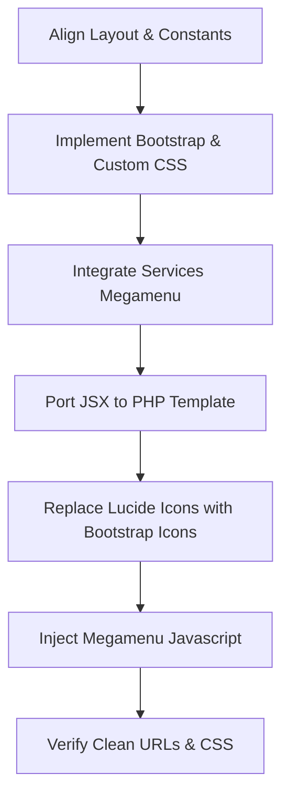

# Migration Plan: React (`ndsai-v2`) to PHP (`ndsai-php`) - Bootstrap & Custom CSS Version

This document outlines the revised step-by-step technical plan for migrating the current React landing page to a PHP codebase using **Bootstrap 5**, **Custom CSS**, and **Bootstrap Icons**, along with incorporating the **Services Megamenu** from the existing `ndsAi` project.

---

## 1. Project Overview & Assessment

We are migrating the landing page from [ndsai-v2](file:///C:/Development/HostingerNds/ndsai-v2) to a new PHP structure under [ndsai-php](file:///C:/Development/HostingerNds/ndsai-php).

### Revised Technical Stack constraints:
* **PHP Framework Structure:** Extensionless PHP page routes (similar to [ndsAi](file:///C:/Development/HostingerNds/ndsAi)).
* **CSS Framework:** **Bootstrap 5.3.3** (via CDN) + **Custom CSS** (No Tailwind CSS).
* **Icon Library:** **Bootstrap Icons** (CDN).
* **Header / Navigation:** Ported from [ndsAi/includes/header.php](file:///C:/Development/HostingerNds/ndsAi/includes/header.php) to incorporate the **Services Megamenu**.
* **Interactivity:** Toggle events for the Megamenu and FAQ Accordion powered by lightweight Vanilla JavaScript.

---

## 2. Directory Structure of `ndsai-php`

We will align the structure of `ndsai-php` to match `ndsAi` for consistency:

```text
ndsai-php/
├── .htaccess                 # URL rewriting (extensionless PHP paths)
├── index.php                 # Landing page / Home
├── router.php                # Local dev server router (for extensionless paths)
├── services/
│   └── ai-sales-automation.php  # Ported page from ndsai-v2
├── includes/
│   ├── head.php              # Global head, Google Fonts, Bootstrap CSS, Bootstrap Icons
│   ├── header.php            # Site Header containing the Megamenu (from ndsAi)
│   ├── footer.php            # Site Footer (from ndsAi / custom)
│   └── scripts.php           # Scripts (Bootstrap Bundle JS, megamenu toggles, custom JS)
└── assets/
    ├── css/
    │   └── style.css         # Theme styles, custom CSS classes, megamenu styling
    ├── js/
    │   └── main.js           # Vanilla JS for Accordion, mobile menu, and megamenu logic
    └── images/               # Shared static assets (logo, illustrations)
```

---

## 3. Migration Roadmap & Conversion Strategy



### Step 1: Base CSS Configuration
Instead of using Tailwind, we will:
1. Load Bootstrap 5.3.3 and Bootstrap Icons 1.11.3 in `includes/head.php`:
   ```html
   <link href="https://cdn.jsdelivr.net/npm/bootstrap@5.3.3/dist/css/bootstrap.min.css" rel="stylesheet">
   <link href="https://cdn.jsdelivr.net/npm/bootstrap-icons@1.11.3/font/bootstrap-icons.min.css" rel="stylesheet">
   ```
2. Copy the CSS custom variables and utility classes from `ndsai-v2/src/App.css` directly into `assets/css/style.css` (e.g., `.serif`, `.eyebrow`, `.btn-lime`, `.card-cream`, `.faq-item`, etc.).
3. Append Megamenu and Header animations styles extracted from `ndsAi/assets/css/style.css` (lines 1118–1454) into `assets/css/style.css`.

### Step 2: The Services Megamenu Integration
1. Extract the Header markup from [ndsAi/includes/header.php](file:///C:/Development/HostingerNds/ndsAi/includes/header.php).
2. Save it in `includes/header.php`. It contains:
   - Bootstrap navbar links (`About`, `Services`, `Agents`, `Creative`, `Consulting`).
   - The `.mega-drop` panels representing the multi-column **Services Megamenu**.
3. Use `$root_prefix` dynamically inside `includes/header.php` to resolve navigation links correctly, whether accessed from `/` or `/services/...`.

### Step 3: Replacing Utility Classes (Tailwind &rarr; Bootstrap)
We will map Tailwind utilities in `SalesAutomation.jsx` to Bootstrap:
* `flex items-center justify-between` &rarr; `d-flex align-items-center justify-content-between`
* `grid grid-cols-2 gap-4` &rarr; `row row-cols-2 g-3` (Bootstrap grid)
* `hidden lg:flex` &rarr; `d-none d-lg-flex`
* `w-full` &rarr; `w-100`
* `sticky top-0` &rarr; `sticky-top`
* Spacing (`px-6 md:px-10 py-20`) &rarr; custom classes or Bootstrap (`px-4 px-md-5 py-5`)

### Step 4: Icon Migration (Lucide &rarr; Bootstrap Icons)
We will rewrite all instances of `lucide-react` icons to the equivalent Bootstrap Icon class:
* `Target` &rarr; `<i class="bi bi-crosshair"></i>`
* `Flame` &rarr; `<i class="bi bi-fire"></i>`
* `Gauge` &rarr; `<i class="bi bi-speedometer2"></i>`
* `ArrowUpRight` &rarr; `<i class="bi bi-arrow-up-right"></i>`
* `Plus` &rarr; `<i class="bi bi-plus-lg"></i>`
* `Zap` &rarr; `<i class="bi bi-lightning-charge"></i>`
* `LineChart` &rarr; `<i class="bi bi-graph-up-arrow"></i>`
* `Check` &rarr; `<i class="bi bi-check-lg"></i>`
* `ShieldCheck` &rarr; `<i class="bi bi-shield-check"></i>`
* `Workflow` &rarr; `<i class="bi bi-diagram-3"></i>`
* `Repeat` &rarr; `<i class="bi bi-arrow-repeat"></i>`
* `Filter` &rarr; `<i class="bi bi-funnel"></i>`

### Step 5: JavaScript Logic Migration
1. Include the Megamenu hover/click JavaScript timers from `ndsAi` in `assets/js/main.js` or `includes/scripts.php`.
2. Add a simple click toggle listener in JavaScript for the FAQ accordion to replace React's local state.

---

## 4. Next Step Implementation

When ready to run, we will:
1. Set up the directory structure and base files in `ndsai-php`.
2. Write `.htaccess` and `router.php`.
3. Create the template files `includes/head.php`, `includes/header.php` (with Megamenu), `includes/footer.php`, and `includes/scripts.php`.
4. Create the stylesheet `assets/css/style.css` combining theme classes and megamenu styling.
5. Create `services/ai-sales-automation.php` containing the ported page, properly translated to Bootstrap 5 + Custom CSS.
